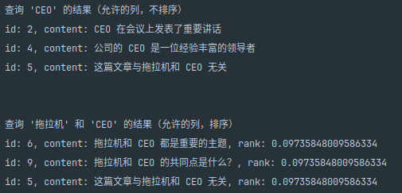
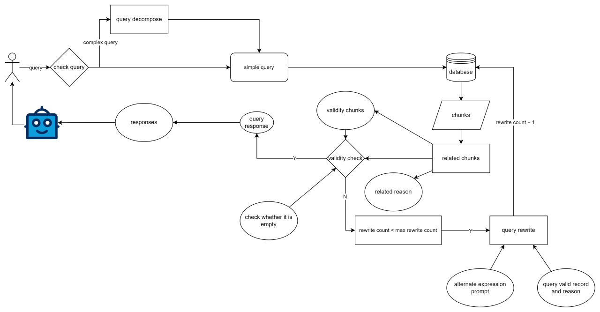

---

## 版本：0.0.1

### 更新日期：2024-09-15

### **Note**:
- 递归爬取数据的项目地址：[https://github.com/li-xiu-qi/recursive-crawl](https://github.com/li-xiu-qi/recursive-crawl)
- 另一个递归爬取数据的项目地址：[https://github.com/Simuoss/ResilientCrawlerVault](https://github.com/Simuoss/ResilientCrawlerVault)

---

### 项目简介

**U-PG-RAG** 是一个基于 PostgreSQL 的校园问答系统后台，专注于管理爬取的数据并存储处理后的内容。本项目充分利用了 PostgreSQL
数据库插件生态，实现了向量与关键词的混合检索功能。

**主要技术栈**：

- **FastAPI**：用于构建高效的 API 接口。
- **SQLAlchemy**：作为 ORM 工具，简化数据库操作。
- **minio**: 提供文件服务

**使用的 PG 插件**：

- **pgvector**：支持向量数据的存储和检索。
- **pg_jieba**：提供中文分词功能，支持关键词检索能力。

### 当前状态（完善中）

当前版本功能较为基础，未来计划扩展更多功能，包括：

- **图谱检索**：计划引入 **AGE** 插件，支持图谱数据的检索能力。
- **前端管理界面**：计划开发基于 **Vue.js** 的前端界面。

### 已经实现：

- **用户授权**：可以通过用户名和密码进行登陆注册。
- **文件上传**：支持文件上传，文件存储在 minio 中。
- **关键词检索**：用户可以通过关键词检索问题，系统会返回相关问题列表。
- **向量检索**：用户可以通过向量检索问题，系统会返回相关问题列表。
- **混合检索**：用户可以通过关键词和向量混合检索问题，系统会返回相关问题列表。
- **多种类型文件数据处理管道**：上传文件后，自动对文件进行处理，提取文本信息，存储到数据库中。

### 效果展示

- **关键词检索**：用户可以通过关键词检索问题，系统会返回相关问题列表。
  

## RAG 设计思路



## 使用方法

### 1. 安装依赖

```bash
pip install -r requirements.txt
```

### 2. 配置数据库

- 在 .env 文件中配置数据库连接信息

`````
# .env 文件
DB_HOST=localhost
DB_PORT=5432
DB_NAME=your_db_name
DB_ADMIN=postgres
DEFAULT_DB_NAME=postgres
DB_ADMIN_PASSWORD=<DB_ADMIN_PASSWORD>
DB_SERVE_USER=yourname
DB_SERVE_USER_PASSWORD=<DB_SERVE_USER_PASSWORD>
SECRET_KEY=<SECRET_KEY>
ALGORITHM="HS256"
ACCESS_TOKEN_EXPIRE_MINUTES=30
# super admin
SUPER_ADMIN_ACCOUNT=yourname
SUPER_ADMIN_PASSWORD=<SUPER_ADMIN_PASSWORD>
SUPER_ADMIN_NAME=yourname
SUPER_ADMIN_EMAIL=<SUPER_ADMIN_EMAIL>

API_KEY=<API_KEY>
BASE_URL=https://your_base_url

# MINIO
MINIO_ACCESS_KEY=<MINIO_ACCESS_KEY>
MINIO_SECRET_KEY=<MINIO_SECRET_KEY>
MINIO_ENDPOINT=localhost:9000
MINIO_REGION=cn-beijing-1
MINIO_BUCKET=university-information

DOWNLOAD_URL_EXPIRY=3600
`````

### 3.启动项目

```bash
uvicorn main:app --reload
```
